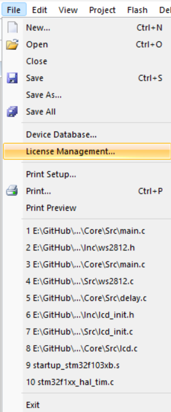
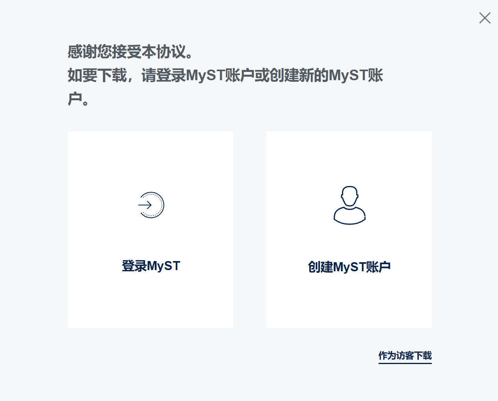
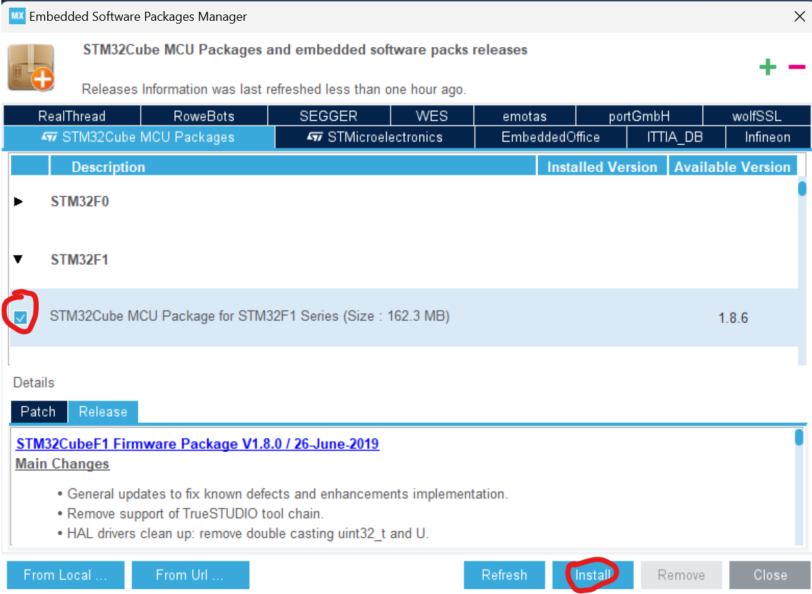

# 软件安装与环境配置

[[ENGLISH]](https://docs.dhu-nuedc.top/docs-stm32-en/introduction/Installation.html)

## Arm Keil MDK社区版安装

### 下载

①打开 [https://www.keil.arm.com/mdk-community/](https://www.keil.arm.com/mdk-community/)

②点击网页中的Download μVision

③填写个人信息

④填写完毕后点击 Submit

⑤点击MDK540.EXE并下载（此网页先不要关闭！）

### 安装

①下载后进行安装

特别提醒：安装目录不建议C盘，且保证整个安装路径中以及pack的路径，不包含任何除了数字、英文字母、下划线以外的字符，否则软件无法正常运行！

②打开(如果激活失败了，再重新以管理员模式打开)

③软件启动

注意：初次打开时可能会弹出Pack Installer窗口

可以先暂且关闭这个窗口，等待后续步骤完成后再点击上方红圈内的按钮来打开Pack Installer

④打开软件后点击左上角的File > License Management

⑤并且选择 User-Based License

⑥点击 Activate / Deactive... 随后Arm证书管理器将会打开

⑦点击右上角的License Server

⑧填写https://mdk-preview.keil.arm.com作为证书地址并且点击Query

⑨选择 Keil MDK Community... 并且点击 Activate

⑩然后这个证书就会被激活

### 安装Pack

先下载

[Keil.STM32F1xx_DFP.2.4.1.pack](https://www.keil.com/pack/Keil.STM32F1xx_DFP.2.4.1.pack)

再双击打开安装

最后不要忘记打开Pack Installer等待安装，当左下角显示

且右下角进度条清空时

则初步安装完毕，可以关闭窗口

安装时间较长，请耐心等待（因为涉及到境外服务器的数据，在校园区域连接校园网下载可能会比宿舍网速更快）

## STM32CubeMX安装

### 注册账号

进入网站[stm32cubemx](https://www.st.com.cn/content/st_com/zh/stm32cubemx.html)

点击下载STM32CubeMX

选择Windows后选择右下角的下载软件

选择创建MyST账户(邮箱用学校的)

信息填写完毕后点击Register

### 下载及安装

等待下载完毕后解压

双击安装，点击Install for all users

同样安装目录不建议C盘，且保证整个安装路径中不包含任何除了数字、英文字母、下划线以外的字符，否则软件无法正常运行！

### 安装固件包

找到STM32CubeMX

打开软件后先点击上方的MyST进行登录

随后点击右侧的INSTALL/REMOVE

仅选择STM32F1中的第一个，点击右下角的Install(可能需要等待一会儿再安装)

